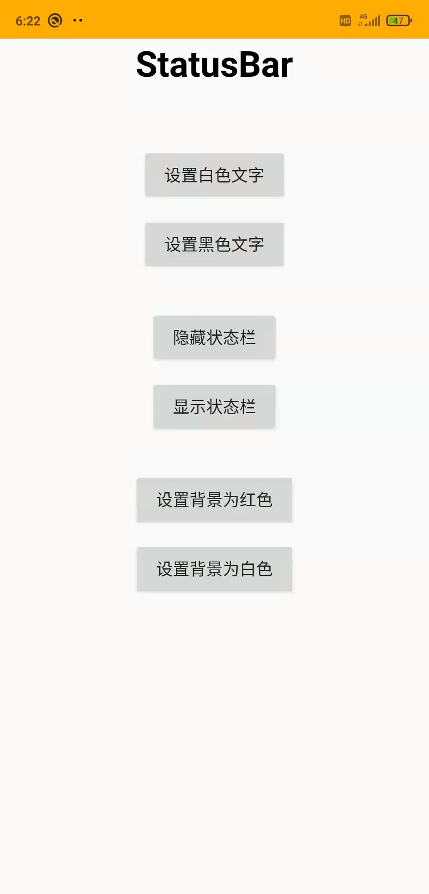
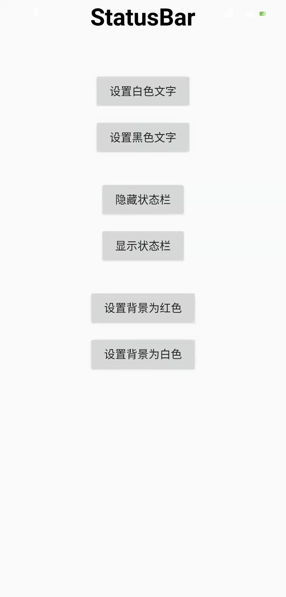

# StatusBar

一个Android状态栏工具类，可以设置状态栏颜色、文字深浅、是否隐藏状态栏。

### 效果预览

|||
|---|---|

### 注意
* 最低支持版本为Android5.0（minSdkVersion 21）
* 本项目仅提供AndroidX版本
* 在setContentView()之后调用

### 特点
* 支持状态栏颜色修改
* 支持状态栏文字深浅模式修改
* 支持隐藏状态栏
* 构建者模式链式调用
* ......

### 基本用法
**Step 1. 添加mavenCentral仓库**
在项目根目录下的 `build.gradle` 中添加仓库:
``` gradle
allprojects {
    repositories {
        ...
        mavenCentral()
    }
}
```
**Step 2. 添加项目依赖**
``` gradle
dependencies {
    implementation 'io.github.csdn-mobile:StatusBar:1.0.0'
}
```
**Step 3. 在Activity中添加代码**
```
// 可同时设置属性
StatusBar.Builder()
        .color(getResources().getColor(R.color.yellow)) // 修改状态栏颜色
        .fontMode(FontMode.DARK) // 状态栏文字深浅模式：FontMode.DARK | FontMode.LIGHT
        .transparent(false) // 是否隐藏状态栏
        .change(this); // 调用该方法后设置生效

// 可单独设置属性
StatusBar.Builder()
        .fontMode(FontMode.LIGHT)
        .change(this);
……
```

### 版本记录
|版本号|更新内容|
|---|---|
|1.0.0|First Version|

